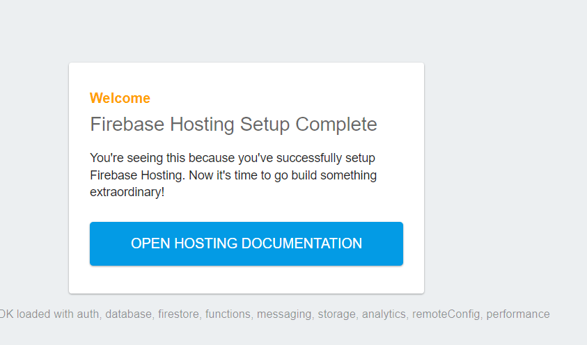

# AngularPos

## Setup
To run the project, type the following commands:

``` 
$ git clone https://github.com/agazinakou/AngularPos.git
$ cd AngularPos
$ npm install 
$ npm run build 
$ npm run start
```

To deploy the project, type the following commands:

```
$ npm run build --prod
$ firebase login
$ firebase init
$ firebase emulators:start
$ firebase deploy
```

## Development server
Run `npm run start` for a dev server. Navigate to `http://localhost:4200/`.

## Troubleshooting steps
If after deployment you see below page, then try to logout and login again with (firebase logout and firebase login commands).



